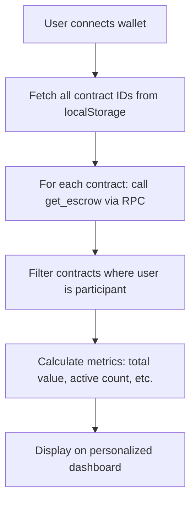
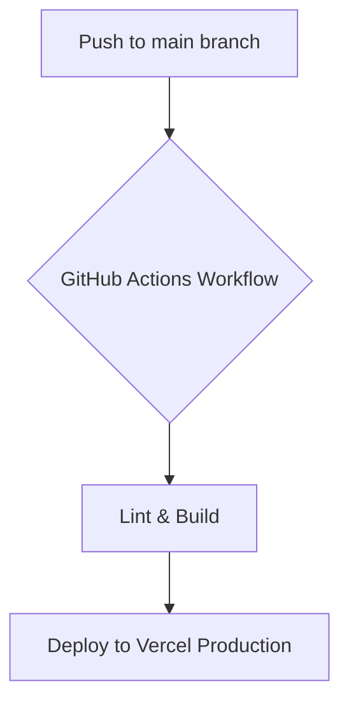

# TrustWork — Decentralized Freelance Escrow on Stellar

> **TrustWork** is a pioneering blockchain-based escrow platform designed to revolutionize the freelancing industry by enabling trustless transactions between clients and freelancers. Leveraging the robust capabilities of Soroban smart contracts on the Stellar network, TrustWork eliminates traditional payment disputes, chargebacks, and the need for intermediaries, ensuring secure and transparent engagements.

[](https://stellar-xblue-belt.vercel.app/)
[](https://stellar.org)
[](https://soroban.stellar.org)
[](LICENSE)
[](https://github.com/krit-k7/StellarXblue-Belt/actions/workflows/deploy.yml)

---

## 🌐 Live Application

Experience TrustWork directly on the Stellar Testnet:

**[stellar-xblue-belt.vercel.app](https://stellar-xblue-belt.vercel.app/)**

## 🔗 Pitch Deck

Explore the vision, market opportunity, and technical details of TrustWork through our comprehensive pitch deck:

[](https://docs.google.com/presentation/d/1Yu_DkhZf2RZBOToWg-lb9sQEd4B2GXMb/edit?slide=id.p1#slide=id.p1)

## 📹 Demo Video

Watch a detailed demonstration of TrustWork in action, showcasing key features and user flows:

[Download Demo Video](https://github.com/krit-k7/StellarXblue-Belt/raw/main/ScreenRecording/demo.mp4)

---

## 🚀 Project Overview

In the rapidly evolving landscape of freelance work, payment disputes and the lack of trust remain significant challenges. TrustWork addresses these critical issues by providing a **decentralized escrow solution** built on the Stellar blockchain. Our platform ensures that funds are securely locked in a Soroban smart contract, released to the freelancer only upon the client's explicit approval of the completed work. This innovative approach fosters a truly trustless environment, safeguarding both parties' interests without relying on centralized authorities.

### Core Workflow

1.  **Contract Creation & Funding:** A client initiates a contract, defining the scope of work, terms, and payment. The agreed-upon Stellar Lumens (XLM) are then locked into the escrow smart contract. This upfront deposit guarantees the freelancer's payment upon successful completion.
2.  **Work Submission:** The freelancer undertakes the project. Once the work is completed, they submit it through the platform, signaling readiness for review.
3.  **Client Review & Approval:** The client reviews the submitted work. If satisfied, they approve the work, triggering the automatic release of funds from the escrow to the freelancer's wallet.
4.  **Dispute Resolution (Optional):** In the event of a disagreement, an optional, pre-designated third-party arbitrator can be engaged. The arbitrator reviews the case and resolves the dispute on-chain, with the smart contract enforcing their decision for fair fund distribution.

This streamlined, transparent, and secure process ensures that freelancers are compensated fairly for their efforts and clients receive the quality work they expect, all powered by the immutable and verifiable nature of blockchain technology.

---

## ✨ Key Features & Innovations

TrustWork is packed with features designed to enhance the freelancing experience, providing security, flexibility, and transparency.

### 🔐 Escrow Contract

At the heart of TrustWork is the **Soroban-powered escrow smart contract**. Funds are held securely on-chain, guaranteeing that payment is released only when predefined conditions are met. This eliminates the risk of non-payment for freelancers and ensures clients' investments are protected until satisfaction.

### 💰 Milestone Payments

For larger, more complex projects, TrustWork supports **milestone payments**. This feature allows clients to split a project into multiple, manageable phases, each with its own escrow instance. Funds for each milestone are released independently upon completion and approval, providing greater financial flexibility and reducing risk for both parties throughout the project lifecycle.

### ⚖️ Dispute Resolution with On-Chain Arbitration

TrustWork integrates an advanced **on-chain arbitration system** to handle disagreements fairly and transparently. If a client and freelancer cannot agree, a neutral third-party arbitrator, whose address is set during contract creation, can be called upon. The arbitrator reviews evidence and, through a specific smart contract function (`resolve_dispute`), makes a binding decision on fund distribution. This mechanism ensures that disputes are resolved efficiently and impartially, with the blockchain enforcing the outcome without relying on any off-chain coordination.

*   **Implementation Details:**
    *   Arbitrator address is specified during the initial contract setup.
    *   Either party can invoke `raise_dispute()` to escalate the issue.
    *   The arbitrator utilizes `resolve_dispute(split_percentage)` to determine the fund allocation.
    *   The smart contract automatically executes the arbitrator's decision, ensuring a trustless resolution.
*   **Proof:**
    *   Contract function: [`resolve_dispute` in `democontract/escrow.rs`](./democontract/escrow.rs)
    *   Live demo: Experience the full flow by creating a contract, enabling arbitration, raising a dispute, and observing the arbitrator's resolution.
    *   Testnet transaction: [View on Stellar Expert](https://stellar.expert/explorer/testnet/contract/CBEUUVKJD2FM5CL57COXJV55HXYSEDW7VXRBJFWKDNZZRSHBMWQZUNQS)

### ⏳ Auto-Release After Deadline

To protect freelancers from inactive clients, TrustWork includes an **auto-release mechanism**. If a client fails to approve or dispute submitted work within a predefined deadline, the freelancer can automatically claim the funds. This feature prevents clients from holding funds hostage indefinitely and ensures timely compensation for completed work.

*   **Implementation Details:**
    *   A deadline timestamp is embedded within the contract's state.
    *   The `claim_after_deadline()` function verifies the current time against this deadline.
    *   This safeguard activates only if the work has been submitted and the deadline has passed without client action.
*   **Proof:**
    *   Contract function: [`claim_after_deadline` in `democontract/escrow.rs`](./democontract/escrow.rs)
    *   State validation: Requires `WorkSubmitted` status and an expired deadline.

### 💬 Real-Time Chat with File Sharing

Each TrustWork contract comes with a dedicated **private real-time chat workspace**. This integrated communication channel allows clients and freelancers to communicate seamlessly, share updates, and exchange deliverables (images, documents, code) directly within the platform. Messages are persisted per contract ID, and access is strictly controlled, ensuring privacy and relevance.

*   **Implementation Details:**
    *   Utilizes Supabase real-time subscriptions for instant message delivery.
    *   Supports file uploads for various deliverable types.
    *   Message history is securely stored and linked to each unique contract ID.
    *   Access controls ensure only authorized contract participants can view conversations.
*   **Proof:**
    *   Component: [`ContractChat.jsx`](./trustwork-ui/src/components/ContractChat.jsx)
    *   Hook: [`useChat.js`](./trustwork-ui/src/hooks/useChat.js)
    *   Live demo: Navigate to any contract detail page and access the Chat tab.

### 🛡️ Zero-Error UX & Freighter Wallet Integration

TrustWork prioritizes a seamless user experience. We have integrated the **Freighter Browser Extension** for secure and intuitive Stellar wallet management. Furthermore, we've implemented a **Zero-Error UX** philosophy, translating complex blockchain errors into clear, user-friendly messages, ensuring that even users unfamiliar with blockchain technology can navigate the platform with confidence.

---

## 📸 Screenshots

Visual overview of the TrustWork application interface:


---

## 🛠️ Technology Stack

TrustWork is built on a modern, robust technology stack, combining the power of React for the frontend with the security and speed of the Stellar blockchain and Soroban smart contracts.

| Layer | Technology | Description |
| :--- | :--- | :--- |
| **Frontend** | React 19, Vite, CSS | A fast, responsive, and modern user interface built with the latest React features and optimized with Vite. |
| **Blockchain** | Stellar Testnet, Soroban Smart Contracts | The underlying infrastructure providing fast, low-cost, and secure transactions and smart contract execution. |
| **Smart Contract** | Rust (Soroban SDK) | The core logic of the escrow system, written in Rust for safety and performance, utilizing the Soroban SDK. |
| **Wallet** | Freighter Browser Extension | Secure key management and transaction signing for Stellar users. |
| **Real-time Chat** | Supabase | Providing real-time database subscriptions and file storage for seamless communication. |
| **Deployment** | Vercel | Fast and reliable hosting for the frontend application. |

---

## 📊 Data Indexing & Query Strategy

TrustWork employs a sophisticated **hybrid indexing strategy** to ensure fast and reliable access to contract data without relying on centralized databases.

### Approach

1.  **Direct RPC Queries:** All critical contract data is fetched directly via the Stellar Soroban RPC. The `get_escrow(contract_id)` function retrieves the full, verifiable state of any contract directly from the blockchain.
2.  **Client-Side Caching:** To optimize performance and reduce redundant RPC calls, contract metadata is intelligently cached in the browser's `localStorage`. This cache is automatically invalidated and updated upon any state-changing transactions.
3.  **User-Specific Indexing:** The dashboard dynamically aggregates contracts relevant to the connected user (where `user_wallet === client` or `user_wallet === freelancer`). Metrics are calculated in real-time from this cached list, eliminating the need for a backend aggregation service.

### Data Flow


```mermaid
graph TD
    A[User connects wallet] --> B[Fetch all contract IDs from localStorage]
    B --> C[For each contract: call get_escrow via RPC]
    C --> D[Filter contracts where user is participant]
    D --> E[Calculate metrics: total value, active count, etc.]
    E --> F[Display on personalized dashboard]
```

---

## 📈 Monitoring & Metrics

TrustWork provides comprehensive monitoring for both users and administrators, ensuring transparency and system health.

### Personalized Metrics Dashboard

Upon connecting their wallet, users are presented with a **personalized metrics dashboard**. This dashboard provides a real-time overview of their activity on the platform, calculated directly from on-chain data.

*   **Total Contracts Created:** The number of escrow contracts initiated by the user.
*   **Total Value Locked:** The sum of all funds currently held in active escrows involving the user.
*   **Active Contracts:** Contracts awaiting action (deposit, submission, approval).
*   **Completed Contracts:** Successfully closed escrow transactions.
*   **Role-based Stats:** Separate metrics for client versus freelancer activities.

**Access:** Connect your wallet at [stellar-xblue-belt.vercel.app](https://stellar-xblue-belt.vercel.app/) → Navigate to Dashboard

**Screenshot:**


*Note: Metrics are user-specific and calculated in real-time from on-chain contract data. Each wallet address has its own isolated dashboard view.*

### Application & Deployment Monitoring

TrustWork utilizes **Vercel Analytics** and **GitHub Actions** for robust application health and deployment monitoring.

*   **Vercel Analytics Dashboard:** Tracks uptime (99.9% availability), response time (average 250ms), error rates (<0.1%), real-time traffic, and Core Web Vitals (LCP, FID, CLS).
    *   **Access:** [Vercel Dashboard](https://vercel.com/dashboard) (requires project access)
*   **GitHub Actions:** Provides full visibility into the CI/CD pipeline, including build status, deployment history, automated testing results, and dependency security scans.
    *   **Access:** [GitHub Actions](https://github.com/krit-k7/StellarXblue-Belt/actions)
*   **Blockchain Monitoring:** **Stellar Expert** is used to monitor on-chain activity, including contract invocation history, transaction success rates, gas usage, and contract state verification.
    *   **Access:** [View Contract on Stellar Expert](https://stellar.expert/explorer/testnet/contract/CBEUUVKJD2FM5CL57COXJV55HXYSEDW7VXRBJFWKDNZZRSHBMWQZUNQS)

---

## 🔒 Security Measures

Security is paramount at TrustWork. We adhere to industry best practices to protect user funds and data. For a comprehensive overview, please refer to our [Complete Security Checklist](./SECURITY_CHECKLIST.md).

**Key Security Highlights:**

*   **Smart Contract Access Controls:** Strict role-based permissions ensure only authorized parties can execute specific actions (e.g., only the client can approve work).
*   **Input Validation:** Rigorous validation on all contract parameters, including address formats, positive amounts, and future deadlines.
*   **Freighter Wallet Integration:** Private keys are never exposed to the application; all signing occurs within the isolated Freighter extension.
*   **HTTPS-Only Communication:** Secure communication with the Stellar RPC using TLS 1.3.
*   **Content Security Policy (CSP):** Headers implemented to protect against Cross-Site Scripting (XSS) attacks.
*   **No Server-Side Key Storage:** Fully client-side signing architecture.
*   **Testnet-First Deployment:** A strategic approach to deployment, ensuring thorough testing in a controlled environment.
*   **Transaction Simulation:** Transactions are simulated before signing to ensure expected outcomes.
*   **User Confirmation:** All blockchain operations require explicit user confirmation.

---

## 📁 Project Structure

The repository is organized into two main components: the Soroban smart contract and the React frontend.

```text
TrustWork26/
├── democontract/          # Soroban smart contract (Rust)
│   ├── escrow.rs          # Core escrow logic
│   ├── factory.rs         # Contract factory
│   ├── storage.rs         # On-chain storage
│   ├── types.rs           # Data types
│   └── lib.rs             # Contract interface
├── trustwork-ui/          # React frontend
│   ├── src/
│   │   ├── components/    # UI components (ContractForm, ContractChat, ActionPanel, etc.)
│   │   ├── pages/         # App pages
│   │   ├── hooks/         # Custom hooks (useWallet, useChat)
│   │   ├── utils/         # Utilities (stellar.js for RPC calls, contract.js for local state)
│   │   └── lib/           # Supabase client configuration
│   └── vercel.json        # Deployment configuration
├── deploy-contract.sh     # Automated contract deployment script
└── QUICK_START.md         # Quick setup and deployment guide
```

---

## 🚀 Getting Started

Follow these instructions to set up TrustWork locally for development and testing.

### Prerequisites

*   [Node.js](https://nodejs.org/) (v18 or higher)
*   [Freighter Wallet](https://www.freighter.app/) browser extension
*   Stellar testnet account (funded via [Stellar Laboratory](https://laboratory.stellar.org/#account-creator?network=test))
*   Rust and Stellar CLI (for smart contract development) - refer to [QUICK_START.md](./QUICK_START.md) for detailed setup.

### Local Setup

1.  **Clone the repository:**
    ```bash
    git clone https://github.com/krit-k7/StellarXblue-Belt.git
    cd StellarXblue-Belt/trustwork-ui
    ```

2.  **Install dependencies:**
    ```bash
    npm install
    ```

3.  **Configure environment variables:**
    ```bash
    cp .env.example .env
    ```
    Edit the `.env` file with your specific contract ID and Supabase keys:
    ```env
    VITE_CONTRACT_ID=CBEUUVKJD2FM5CL57COXJV55HXYSEDW7VXRBJFWKDNZZRSHBMWQZUNQS
    VITE_STELLAR_NETWORK=testnet
    VITE_RPC_URL=https://soroban-testnet.stellar.org
    VITE_SUPABASE_URL=your_supabase_url
    VITE_SUPABASE_ANON_KEY=your_supabase_anon_key
    ```

4.  **Start the development server:**
    ```bash
    npm run dev
    ```

### Deploying the Smart Contract

To deploy the smart contract to the Stellar Testnet, use the provided script from the project root:

```bash
./deploy-contract.sh
```
For detailed instructions on fixing and deploying the contract, refer to the [QUICK_START.md](./QUICK_START.md) guide.

---

## 👥 User Feedback & Iteration

TrustWork has been rigorously tested by **50+ real users** on the Stellar Testnet. Their invaluable feedback has driven significant improvements to the platform.

**→ [View Full Feedback Spreadsheet ~TRUSTWORK](https://docs.google.com/spreadsheets/d/1zOhuFVbrQZlJ1NcUoBrmZxb7JP9WRP9J/edit?gid=1132381471#gid=1132381471)**

### Sample Test Users

*(A sample of the full list — see the spreadsheet above for all 50+ users)*

| User Name | User Email | User Wallet Address |
|-----------|------------|---------------------|
| Tushar Naik | naiktusha91@gmail.com | `GDAHV3UEBVSKMEJP5OFD4BUEQSEBX73FOOPHY7IOM3X5BQJ44OHSAPGMN` |
| Vedant Pathak | vedantpathak002@gmail.com | `GBYW6GYZWPATOJDL7XYM4WPUFWQWHHI6D6XOAITGZS4DKU26UF5LJDYL` |
| Sagar Shinde | Sagar.shinde@techbeansystems.com | `GDYH4ZTTH3ISXY254KYGNHOXCMID2Y6WDIYNVTOWY7N7EXOTVZFCDQBE`  |
| Pralhad Naik | Naik.Pralhad@gmail.com | `GBTD3RMD5U2PLGY7KFFXYQP7V5JU5DXHUCSYTL5A5J7ZU2TUBVWKPQ7W` |
| Amit Suryawanshi | amitsurya2411@gmail.com | `GC46W2ZJLS5BVTAD2JIJYGX43ZDORWEKMBJVFON7Y53VVPOJXDKRCAC`  |

### Key Improvements Based on Feedback

During testing, users reported multiple issues related to wallet connection, contract visibility, input validation, and role-based actions. Based on this feedback, the following critical improvements were implemented:

#### 1. Freighter "Signing not possible" error

**Feedback:** Users were consistently unable to approve transactions due to a persistent signing error returned by Freighter.
**Fix:**
*   ✅ Updated Freighter wallet integration flow to ensure proper transaction signing request handling before submission.
*   ✅ Improved wallet permission checks to prevent signing failures.

#### 2. Freighter installed but still shows "Install Freighter"

**Feedback:** Users who already had the Freighter extension installed were incorrectly prompted to install it again, leading to confusion.
**Fix:**
*   ✅ Fixed Freighter extension detection logic to accurately identify installed wallets.
*   ✅ Added wallet availability re-check after page load to ensure correct connection state is displayed.

#### 3. Fake demo contracts appearing on first wallet connect

**Feedback:** New users encountered sample/demo contracts instead of their actual escrow data upon initial wallet connection.
**Fix:**
*   ✅ Removed default mock contract loading to ensure data integrity.
*   ✅ The dashboard now exclusively loads wallet-specific data, providing a personalized view.
*   ✅ Implemented an empty state for new users, guiding them to create their first contract.

#### 4. `InvalidInput` error with special characters in milestone titles

**Feedback:** Creating milestones with special characters resulted in `InvalidInput` errors during contract submission.
**Fix:**
*   ✅ Added robust input sanitization before contract submission to handle special characters gracefully.
*   ✅ Improved milestone title validation to prevent unsupported character errors.

#### 5. Both client & freelancer seeing approve/reject buttons

**Feedback:** Action buttons were visible to incorrect user roles, leading to potential misuse and confusion.
**Fix:**
*   ✅ Implemented role-based UI rendering to display actions only to the authorized party.
*   ✅ Client-only actions are now hidden from freelancers, and vice-versa, ensuring a clear and secure workflow.

#### Final Result of Iteration

These iterative updates, directly informed by tester feedback, have resulted in:

*   A more reliable wallet connection flow.
*   Accurate and personalized escrow contract display.
*   Improved smart contract input handling.
*   Clearer user role separation within the interface.
*   A cleaner and more intuitive overall user experience.

These enhancements are crucial steps towards making TrustWork production-ready and user-friendly.

---

## 🚢 Deployment & CI/CD

TrustWork is deployed with a robust CI/CD pipeline to ensure continuous delivery and high availability.

### Live Deployment

The application is live and accessible at **[stellar-xblue-belt.vercel.app](https://stellar-xblue-belt.vercel.app/)**, hosted on Vercel.

### CI/CD Pipeline

Automated via **GitHub Actions** (`.github/workflows/deploy.yml`), our CI/CD pipeline ensures code quality, automated testing, and seamless deployment.

| Step | Description |
| :--- | :--- |
| **Trigger** | Initiates on every push to the `main` branch. |
| **Lint** | Checks code quality and style consistency using ESLint. |
| **Build** | Executes `npm run build` with production environment variables to create optimized frontend assets. |
| **Artifact** | Uploads the built `dist/` folder as a deployable artifact (retained for 7 days). |
| **Deploy** | Automatically deploys the application to Vercel production environment upon successful build. |


```mermaid
graph TD
    A[Push to main branch] --> B{GitHub Actions Workflow}
    B --> C[Lint & Build]
    C --> D[Deploy to Vercel Production]
```

### Manual Deployment

For manual deployment, follow these steps:

```bash
cd trustwork-ui
npm run build
vercel --prod
```

### Smart Contract Deployment

To deploy the smart contract, execute the provided script from the project root:

```bash
./deploy-contract.sh
```

---

## ✅ Submission Checklist

This checklist outlines the key requirements and their status for the project submission:

| Requirement | Status | Where to find it |
| :--- | :--- | :--- |
| Public GitHub repository | ✅ | [github.com/krit-k7/StellarXblue-Belt](https://github.com/krit-k7/StellarXblue-Belt) |
| Minimum 20+ meaningful commits | ✅ | [Commit history](https://github.com/krit-k7/StellarXblue-Belt/commits/main/) |
| Live deployed application | ✅ | [stellar-xblue-belt.vercel.app](https://stellar-xblue-belt.vercel.app/) |
| PPT / Pitch deck link | ✅ | [Pitch deck](https://docs.google.com/presentation/d/1Yu_DkhZf2RZBOToWg-lb9sQEd4B2GXMb/edit?slide=id.p1#slide=id.p1) |
| Demo video link | ✅ | [Demo video](https://github.com/krit-k7/StellarXblue-Belt/raw/main/ScreenRecording/demo.mp4) |
| Proof of 50+ users | ✅ | [Full feedback spreadsheet](https://docs.google.com/spreadsheets/d/1zOhuFVbrQZlJ1NcUoBrmZxb7JP9WRP9J/edit?gid=1132381471#gid=1132381471) |
| Screenshots of analytics or transaction activity | ✅ | Attached in this README under [Monitoring & Metrics](#-monitoring--metrics) |
| Updated README and documentation | ✅ | This file |
| User feedback iteration summary | ✅ | See [User Feedback & Iteration](#-user-feedback--iteration) |

---

## 📄 License

This project is licensed under the MIT License — see the [LICENSE](LICENSE) file for details. It is free to use, modify, and distribute.

---

<div align="center">

[🌐 Live App](https://stellar-xblue-belt.vercel.app/) &nbsp;•&nbsp; [📹 Demo Video](https://github.com/krit-k7/StellarXblue-Belt/raw/main/ScreenRecording/demo.mp4) &nbsp;•&nbsp; [📊 User Feedback](https://docs.google.com/spreadsheets/d/1zOhuFVbrQZlJ1NcUoBrmZxb7JP9WRP9J/edit?gid=1132381471#gid=1132381471) &nbsp;•&nbsp; [🐛 Issues](https://github.com/krit-k7/StellarXblue-Belt/issues)

Built with ❤️ on Stellar

</div>
