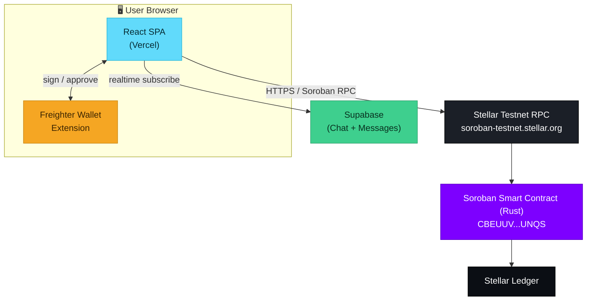
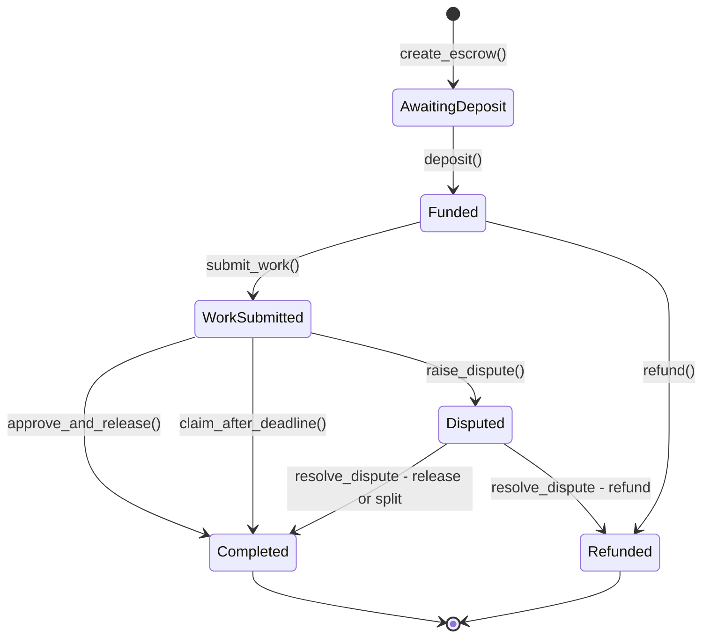
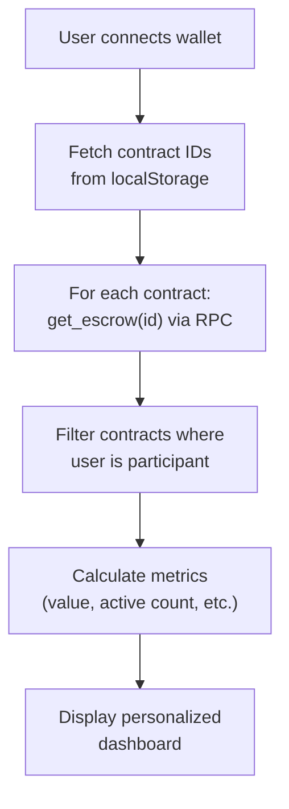

<div align="center">


# TrustWork

### Decentralized Freelance Escrow on Stellar

*A blockchain-based escrow platform where clients and freelancers transact trustlessly using Soroban smart contracts on the Stellar network. No middlemen. No chargebacks. No "the client ghosted me after I delivered the work."*

[](https://stellar-xblue-belt.vercel.app/)
[](https://stellar.org)
[](https://soroban.stellar.org)
[](LICENSE)
[](https://github.com/krit-k7/StellarXblue-Belt/actions/workflows/deploy.yml)

<br/>


</div>

---

## Table of Contents

- [Live Links & Resources](#live-links--resources)
- [Overview](#overview)
- [How It Works](#how-it-works)
- [Screenshots](#screenshots)
- [Architecture](#architecture)
- [Smart Contract Deep Dive](#smart-contract-deep-dive)
- [Tech Stack](#tech-stack)
- [Features](#features)
- [Data Indexing & Query Strategy](#data-indexing--query-strategy)
- [Getting Started](#getting-started)
- [Project Structure](#project-structure)
- [Security](#security)
- [Metrics Dashboard](#metrics-dashboard)
- [Monitoring](#monitoring)
- [Testing & User Feedback](#testing--user-feedback)
- [Community Contribution](#community-contribution)
- [Deployment & CI/CD](#deployment--cicd)
- [Roadmap](#roadmap)
- [Contributing](#contributing)
- [License](#license)
- [Submission Checklist](#submission-checklist)

---

<a name="live-links--resources"></a>
##  Live Links & Resources

| Resource | Link |
|---|---|
| 🌐 Live Application | [stellar-xblue-belt.vercel.app](https://stellar-xblue-belt.vercel.app/) |
| 🔗 Pitch Deck | [View Presentation](https://docs.google.com/presentation/d/1Yu_DkhZf2RZBOToWg-lb9sQEd4B2GXMb/edit?slide=id.p1#slide=id.p1) |
| 📹 Demo Video | [Download Demo Video](https://github.com/krit-k7/StellarXblue-Belt/raw/main/ScreenRecording/demo.mp4) |
| 📊 User Feedback (50+ responses) | [Full Feedback Spreadsheet](https://docs.google.com/spreadsheets/d/1zOhuFVbrQZlJ1NcUoBrmZxb7JP9WRP9J/edit?gid=1132381471#gid=1132381471) |
| 🧾 Repository | [github.com/krit-k7/StellarXblue-Belt](https://github.com/krit-k7/StellarXblue-Belt) |
| 🐦 Community Post | [View Twitter/X Post](https://x.com/krit_giri/status/2050516673879527867) |
| 🔎 Contract Explorer | [Stellar Expert](https://stellar.expert/explorer/testnet/contract/CBEUUVKJD2FM5CL57COXJV55HXYSEDW7VXRBJFWKDNZZRSHBMWQZUNQS) |

---

<a name="overview"></a>
## 📌 Overview

Freelance work runs on trust that usually isn't there. Clients worry about paying upfront for work that never arrives; freelancers worry about delivering work and never getting paid. Traditional platforms solve this with centralized escrow — but that means fees, opaque dispute processes, chargebacks, and a middleman who can freeze funds at will.

**TrustWork removes the middleman entirely.** Funds are locked in a Soroban smart contract on the Stellar network the moment a contract is funded, and they can only move according to rules written into the contract itself: released when the client approves, refunded when the client cancels before work starts, split by an arbitrator if there's a dispute, or auto-claimed by the freelancer if the client disappears. Every rule is enforced by code running on a public ledger, not by a company's internal policy.

The project is built as a full end-to-end product rather than just a contract demo: a Rust/Soroban smart contract handles the actual custody of funds, a React frontend gives clients and freelancers a normal web-app experience, Freighter handles wallet signing, and Supabase powers a real-time chat workspace so both parties can coordinate and share deliverables without ever leaving the platform.

---

<a name="how-it-works"></a>
## ⚙️ How It Works

TrustWork models a freelance engagement as a state machine that lives entirely on-chain. Here's the full lifecycle of a contract, from creation to payout:

1. **Contract creation.** The client (buyer) creates an escrow, specifying the freelancer's (seller's) wallet address, the payment token (native XLM or any Stellar Asset Contract token), the agreed amount, a deadline, and — optionally — an arbitrator address for dispute resolution. The escrow starts in the `AwaitingDeposit` state.

2. **Funding the escrow.** The client approves the contract as a token spender (a standard SEP-41 allowance) and calls `deposit()`. The contract pulls the funds from the client's wallet into its own custody using `transfer_from`, and the escrow moves to `Funded`. From this point, neither party can access the funds except through the rules below.

3. **Doing the work.** The freelancer completes the work and, importantly, can share drafts, files, and updates with the client through TrustWork's built-in real-time chat — a private workspace scoped to that specific contract. When the deliverable is ready, the freelancer calls `submit_work()`, moving the escrow to `WorkSubmitted`.

4. **Review and release.** The client reviews the submitted work. If satisfied, they call `approve_and_release()`, and the full amount is transferred from the contract straight to the freelancer's wallet — no invoice processing, no payment batching, no waiting period. The escrow closes as `Completed`.

5. **If something goes wrong.** Two safety valves exist on either side:
   - **Client-side:** before the freelancer ever submits work, the client can call `refund()` to unilaterally reclaim the funds — useful if the engagement is cancelled early.
   - **Freelancer-side:** if the client goes silent after work has been submitted and the deadline has passed, the freelancer can call `claim_after_deadline()` to release the funds to themselves without needing the client's cooperation.

6. **Disputes.** If the client and freelancer disagree about whether the work meets the agreed terms, either party can escalate by calling `raise_dispute()` (only available if an arbitrator was configured at contract creation). The arbitrator reviews the situation off-chain and calls `resolve_dispute()` with a binding decision — full release to the freelancer, full refund to the client, or a percentage split between the two. The contract enforces whatever the arbitrator decides automatically.

Every one of these transitions emits an on-chain event, so the frontend (and any block explorer) can track a contract's history in real time without needing a centralized backend.

---

<a name="screenshots"></a>
## 🖼️ Screenshots


---

<a name="architecture"></a>
##  Architecture

TrustWork has three moving parts that never trust each other implicitly — the frontend, the wallet, and the contract each independently enforce their own piece of the rules.

### System Overview


```mermaid
flowchart TB
    subgraph Browser["🖥️ User Browser"]
        UI["React SPA<br/>(Vercel)"]
        Wallet["Freighter Wallet<br/>Extension"]
        UI <-->|"sign / approve"| Wallet
    end

    UI -->|"HTTPS / Soroban RPC"| RPC["Stellar Testnet RPC<br/>soroban-testnet.stellar.org"]
    UI -->|"realtime subscribe"| SB["Supabase<br/>(Chat + Messages)"]
    RPC --> SC["Soroban Smart Contract (Rust)<br/>CBEUUV...UNQS"]
    SC --> Ledger["Stellar Ledger"]

    style SC fill:#7D00FF,stroke:#5b00c2,color:#ffffff
    style RPC fill:#1b1f27,stroke:#000000,color:#ffffff
    style SB fill:#3ECF8E,stroke:#2ea36e,color:#08301f
    style UI fill:#61DAFB,stroke:#2ab8d9,color:#062b33
    style Wallet fill:#f5a623,stroke:#c9840e,color:#3a2400
    style Ledger fill:#0b0e14,stroke:#000000,color:#ffffff
```

### Component Responsibilities

| Component | Role | Talks To |
|-----------|------|----------|
| **React Frontend** | UI, state management, routing | Stellar RPC, Supabase, Freighter |
| **Freighter Wallet** | Signs every blockchain transaction locally; the app never touches a private key | Stellar Network |
| **Soroban Smart Contract** | Holds funds in custody, enforces every escrow rule | Stellar Ledger |
| **Stellar RPC** | Submits and simulates transactions, reads contract state | Smart Contract |
| **Supabase** | Real-time chat messages between the two parties on a contract | Frontend only |
| **Vercel** | Hosts and serves the built React app | — |
| **GitHub Actions** | Lints, builds, and deploys on every push | Vercel |

### Contract State Machine

Every escrow instance moves through a strict set of states. There is no way to skip a step or move backward outside of the transitions below — the contract simply rejects any call that doesn't match the current state.


```mermaid
stateDiagram-v2
    [*] --> AwaitingDeposit: create_escrow()
    AwaitingDeposit --> Funded: deposit()
    Funded --> WorkSubmitted: submit_work()
    Funded --> Refunded: refund()
    WorkSubmitted --> Completed: approve_and_release()
    WorkSubmitted --> Completed: claim_after_deadline()
    WorkSubmitted --> Disputed: raise_dispute()
    Disputed --> Completed: resolve_dispute - release or split
    Disputed --> Refunded: resolve_dispute - refund
    Completed --> [*]
    Refunded --> [*]
```

### Frontend Structure

```
src/
├── pages/
│   ├── Home.jsx           # Landing page
│   ├── Dashboard.jsx      # Contract list + personalized stats
│   ├── CreateContract.jsx # Multi-step contract builder
│   ├── ContractDetail.jsx # Contract view + on-chain actions
│   └── Arbitration.jsx    # Dispute resolution panel
├── components/
│   ├── ContractForm.jsx   # 4-step form (template → parties → terms → review)
│   ├── ContractChat.jsx   # Real-time chat per contract
│   ├── ActionPanel.jsx    # On-chain action buttons (deposit, approve, etc.)
│   ├── Navbar.jsx         # Navigation
│   ├── WalletModal.jsx    # Freighter connection flow
│   └── TxModal.jsx        # Transaction signing status
├── hooks/
│   ├── useWallet.js       # Freighter detection, connect, session restore
│   └── useChat.js         # Supabase real-time chat
└── utils/
    ├── stellar.js         # All Soroban contract calls
    └── contract.js        # Local state, localStorage, validation
```

---

<a name="smart-contract-deep-dive"></a>
##  Smart Contract Deep Dive

The escrow logic lives in `democontract/escrow.rs`, with shared types (`EscrowState`, `EscrowError`, `Resolution`) in `types.rs`, on-chain persistence helpers in `storage.rs`, and multi-instance creation in `factory.rs`. Every state-changing function follows the same pattern: load the escrow's config from storage, check who's calling and what state it's in, move tokens if needed, save the new state, and emit an event.

All token movement goes through the standard Soroban token interface (SEP-41 / Stellar Asset Contract), which is what makes the contract compatible with native XLM as well as any other Stellar Asset Contract token without extra integration work.

### Contract Functions Reference

| Function | Description |
|----------|-------------|
| `create_escrow` | Creates a new escrow instance with buyer, seller, amount, deadline, and optional arbitrator |
| `deposit` | Client locks funds into escrow (pulls via `transfer_from`, requires a prior token allowance) |
| `submit_work` | Freelancer marks work as submitted |
| `approve_and_release` | Client approves and releases payment to the freelancer |
| `refund` | Client reclaims funds before work is submitted |
| `raise_dispute` | Escalates a submitted contract to arbitration |
| `resolve_dispute` | Arbitrator resolves with a full award or a percentage split |
| `claim_after_deadline` | Freelancer claims funds if the client goes inactive past the deadline |
| `get_escrow` | Reads full escrow state (read-only) |

### Function Walkthrough

**`deposit(escrow_id)`** — Requires the escrow to be in `AwaitingDeposit` and the deadline to not have passed yet. Requires the client's (`buyer`) signature. Because the contract uses `transfer_from` rather than a plain transfer, the client must first grant the contract a token allowance (`token.approve(buyer, contract_address, amount, expiration_ledger)`) before this call will succeed — this is standard SEP-41 behavior, not a TrustWork-specific step. On success, the escrow moves to `Funded` and a `deposited` event fires.

**`submit_work(escrow_id)`** — Requires the escrow to be `Funded` and the freelancer's (`seller`) signature. This is a pure status flag: the actual deliverable itself is exchanged through the contract's chat workspace, not stored on-chain. Moves the escrow to `WorkSubmitted` and emits `submitted`.

**`approve_and_release(escrow_id)`** — Requires the escrow to be `WorkSubmitted` and the client's signature. Transfers the full escrowed amount from the contract to the freelancer and closes the escrow as `Completed`, emitting `released`.

**`refund(escrow_id)`** — Requires the escrow to be `Funded` (i.e., before `submit_work` has been called) and the client's signature. Transfers the full amount back to the client and moves the escrow to `Refunded`, emitting `refunded`. In practice, this lets a client cancel an engagement unilaterally at any point before the freelancer has delivered anything — it doesn't require waiting for the deadline to pass.

**`raise_dispute(escrow_id)`** — Requires the escrow to be `WorkSubmitted` and an arbitrator to have been set at creation time (otherwise it fails with `NoArbitrator`). Moves the escrow to `Disputed` and emits `disputed`.

**`resolve_dispute(escrow_id, resolution)`** — Requires the escrow to be `Disputed` and the arbitrator's signature. `Resolution` is one of three variants:
- `ReleaseToSeller` — full amount to the freelancer, escrow closes `Completed`.
- `RefundToBuyer` — full amount back to the client, escrow closes `Refunded`.
- `Split(seller_pct)` — an integer-percentage split between the two parties (Soroban contracts don't support floating-point math, so the split is computed as `seller_amount = amount * seller_pct / 100` and `buyer_amount = amount - seller_amount`), closing as `Completed`.

Every outcome emits a `resolved` event.

**`claim_after_deadline(escrow_id)`** — Requires the escrow to be `WorkSubmitted`, the freelancer's signature, and the current ledger timestamp to be at or past the configured deadline (otherwise it fails with `DeadlineNotReached`). Transfers the full amount to the freelancer and closes the escrow as `Completed`, emitting `autoclaimed`. This exists specifically to protect freelancers from clients who receive the work and simply stop responding.

### Design Notes & Current Limitations

- **Events over polling.** Every state-changing call emits an on-chain event via `env.events().publish(...)`, so the frontend (or any external indexer) can react to contract activity in real time instead of continuously polling full contract state.
- **Integer-only math.** Percentage splits in `resolve_dispute` use integer division since Soroban has no floating-point support — worth keeping in mind if the split logic is extended (e.g., for finer-grained percentages).
- **`raise_dispute` authorization.** In the current implementation, `raise_dispute` checks the freelancer's (`seller`) signature regardless of which party initiates the call. The intent — and the UI — is for either party to be able to raise a dispute, so generalizing this check to accept either the buyer's or seller's signature is a natural next step before treating this as fully "either party" in production.

---

<a name="tech-stack"></a>
##  Tech Stack

| Layer | Technology |
|-------|-----------|
| Frontend | React 19, Vite, CSS |
| Blockchain | Stellar Testnet, Soroban Smart Contracts |
| Smart Contract | Rust (Soroban SDK) |
| Wallet | Freighter Browser Extension |
| Real-time Chat | Supabase |
| Deployment | Vercel, GitHub Actions |

**Codebase snapshot:** JavaScript 84.1% · CSS 8.6% · Rust 5.5% · Shell 1.7% · HTML 0.1%, across 36+ commits on `main`. ([Commit history](https://github.com/krit-k7/StellarXblue-Belt/commits/main/))

---

<a name="features"></a>
## ✨ Features

- **Escrow Contract** — Funds are locked on-chain the moment a contract is funded and can only move according to the rules encoded in the contract, not according to any single party's discretion.
- **Milestone Payments** — Larger engagements can be split into multiple escrow instances, so payment is tied to discrete chunks of work rather than an all-or-nothing release at the end.
- **Dispute Resolution** — An optional third-party arbitrator can be attached to any contract at creation time, with binding, on-chain enforcement of their decision.
- **Auto-Release** — If a client stops responding after work is submitted, the freelancer isn't stuck waiting indefinitely — they can claim the funds themselves once the deadline passes.
- **Real-time Chat** — Each contract gets its own private workspace with file sharing, so deliverables and discussion stay attached to the exact engagement they belong to.
- **Freighter Wallet Integration** — Wallet connection, session persistence, and transaction signing are all handled through Freighter, so private keys never touch the TrustWork frontend or servers.
- **Zero-Error UX** — Raw Soroban/RPC error codes are translated into plain-language messages so users aren't staring at a stack trace when a transaction fails.

| Feature | Status |
|---------|--------|
| 🌙 Dark Mode | ✅ |
| ☀️ Light Mode | ✅ |
| 📱 Responsive | ✅ |
| ⚡ Fast Performance | ✅ | 


---

<a name="data-indexing--query-strategy"></a>
## 📊 Data Indexing & Query Strategy

### Approach

TrustWork uses a **hybrid indexing strategy** that combines direct on-chain queries with client-side caching, rather than running a centralized indexing backend:

1. **Direct RPC Queries** — All contract data is fetched live via Stellar's Soroban RPC. `get_escrow(contract_id)` returns the full state for a given contract, so there's no need for a separate database mirroring on-chain state.
2. **Client-Side Caching** — Contract metadata (IDs the user has interacted with) is cached in the browser's `localStorage`, cutting down on redundant RPC calls for contracts the user visits repeatedly. The cache is invalidated whenever a state-changing transaction goes through.
3. **User-Specific Indexing** — The dashboard aggregates only the contracts where the connected wallet is either the client or the freelancer, computing metrics in real time from that filtered list rather than from a backend aggregation service.

### Data Flow


```mermaid
flowchart TD
    A["User connects wallet"] --> B["Fetch contract IDs<br/>from localStorage"]
    B --> C["For each contract:<br/>get_escrow(id) via RPC"]
    C --> D["Filter contracts where<br/>user is participant"]
    D --> E["Calculate metrics<br/>(value, active count, etc.)"]
    E --> F["Display personalized<br/>dashboard"]
```

### Endpoints

| Endpoint | Purpose | Response |
|----------|---------|----------|
| `stellar.js → getEscrow(id)` | Fetch single contract state | `{ status, amount, client, freelancer, ... }` |
| `stellar.js → simulateTransaction()` | Preview a transaction before signing | Gas estimate + result preview |
| `contract.js → getAllContracts()` | Load the user's contract list from cache | Array of contract metadata |

**Try it:** connect a wallet at [stellar-xblue-belt.vercel.app](https://stellar-xblue-belt.vercel.app/) to see your indexed contracts.

---

<a name="getting-started"></a>
##  Getting Started

### Prerequisites

- [Node.js](https://nodejs.org/) v18+
- [Freighter Wallet](https://www.freighter.app/) browser extension
- A Stellar testnet account, funded via [Stellar Laboratory](https://laboratory.stellar.org/#account-creator?network=test)

### Local Setup

```bash
# Clone the repository
git clone https://github.com/krit-k7/StellarXblue-Belt.git
cd StellarXblue-Belt/trustwork-ui

# Install dependencies
npm install

# Configure environment
cp .env.example .env
# Edit .env with your contract ID and Supabase keys

# Start development server
npm run dev
```

### Environment Variables

```env
VITE_CONTRACT_ID=CBEUUVKJD2FM5CL57COXJV55HXYSEDW7VXRBJFWKDNZZRSHBMWQZUNQS
VITE_STELLAR_NETWORK=testnet
VITE_RPC_URL=https://soroban-testnet.stellar.org
VITE_SUPABASE_URL=your_supabase_url
VITE_SUPABASE_ANON_KEY=your_supabase_anon_key
```

### Deploying the Smart Contract

```bash
# From project root
./deploy-contract.sh
```

This compiles the Soroban contract, deploys it to Stellar Testnet, and prints the resulting contract ID — copy that into `VITE_CONTRACT_ID` in your `.env`.

---

<a name="project-structure"></a>
## 📁 Project Structure

```
StellarXblue-Belt/
├── .github/
│   └── workflows/         # GitHub Actions CI/CD pipeline
├── ScreenRecording/        # Demo video assets
├── democontract/           # Soroban smart contract (Rust)
│   ├── escrow.rs           # Core escrow logic (state machine + transfers)
│   ├── factory.rs          # Contract factory for creating new escrow instances
│   ├── storage.rs          # On-chain storage read/write helpers
│   ├── types.rs            # Shared types (EscrowState, EscrowError, Resolution)
│   └── lib.rs              # Contract interface / entrypoints
├── trustwork-ui/            # React frontend
│   ├── src/
│   │   ├── components/     # UI components
│   │   ├── pages/          # App pages
│   │   ├── hooks/          # useWallet, useChat
│   │   ├── utils/          # stellar.js, contract.js
│   │   └── lib/            # Supabase client
│   └── vercel.json         # Deployment config
├── deploy-contract.sh       # Contract deployment script
├── SECURITY_CHECKLIST.md    # Full security checklist
└── QUICK_START.md           # Quick setup guide
```

---

<a name="security"></a>
## 🔒 Security

TrustWork follows a non-custodial, client-side signing architecture, ensuring that private keys and funds always remain under the user's control. The platform never stores or accesses sensitive wallet credentials.

**→ [View Complete Security Checklist](./SECURITY_CHECKLIST.md)**

### Key Security Measures

- ✅ Smart contract access controls — only authorized parties can execute each action (`require_auth()` checks on every state-changing call)
- ✅ Input validation on all contract parameters
- ✅ Freighter wallet integration — private keys never exposed to the app
- ✅ HTTPS-only communication with Stellar RPC
- ✅ Content Security Policy headers (XSS protection)
- ✅ No server-side key storage — fully client-side signing
- ✅ Testnet-first deployment strategy before any mainnet consideration
- ✅ Transaction simulation before signing, so users can preview outcomes
- ✅ Explicit user confirmation required for every blockchain operation

---

<a name="metrics-dashboard"></a>
## 📊 Metrics Dashboard

TrustWork gives every connected wallet a **personalized metrics dashboard**, computed in real time from on-chain data:

- **Total Contracts Created** — Number of escrow contracts the wallet has initiated
- **Total Value Locked** — Sum of funds currently held across the wallet's active escrows
- **Active Contracts** — Contracts awaiting an action (deposit, submission, approval)
- **Completed Contracts** — Successfully closed escrow transactions
- **Role-based Stats** — Separate breakdowns for client-side vs. freelancer-side activity

**Access:** Connect your wallet at [stellar-xblue-belt.vercel.app](https://stellar-xblue-belt.vercel.app/) → navigate to Dashboard.


*Metrics are wallet-specific — each address sees only its own isolated dashboard view, since everything is computed from that wallet's on-chain contract history.*

---

<a name="monitoring"></a>
##  Monitoring

TrustWork tracks application, deployment, and on-chain health through three separate lenses:

### Application Monitoring
**Vercel Analytics** tracks uptime, response time, error rate, live traffic, and Core Web Vitals (LCP, FID, CLS) for the deployed app.
**Access:** [Vercel Dashboard](https://vercel.com/dashboard) (requires project access)

### Deployment Monitoring
**GitHub Actions** provides CI/CD pipeline visibility — build success/failure status, deployment history with rollback capability, automated test results, and dependency security scans.
**Access:** [GitHub Actions](https://github.com/krit-k7/StellarXblue-Belt/actions)

### Blockchain Monitoring
**Stellar Expert** surfaces on-chain activity for the deployed contract — invocation history, transaction success rate, and contract state verification.
**Access:** [View Contract on Stellar Expert](https://stellar.expert/explorer/testnet/contract/CBEUUVKJD2FM5CL57COXJV55HXYSEDW7VXRBJFWKDNZZRSHBMWQZUNQS)

---

<a name="testing--user-feedback"></a>
##  Testing & User Feedback

TrustWork was tested on Stellar Testnet by **50+ real users**, whose wallet addresses and feedback are recorded in the linked spreadsheet.

**→ [View Full Feedback Spreadsheet](https://docs.google.com/spreadsheets/d/1zOhuFVbrQZlJ1NcUoBrmZxb7JP9WRP9J/edit?gid=1132381471#gid=1132381471)**

### What We Changed (In Response)

Testing surfaced real, specific bugs — here's what got fixed as a direct result of user feedback:

**1. Freighter "Signing not possible" error**
Users couldn't approve transactions because Freighter returned a signing error. Fixed by reworking the wallet integration flow, adding proper transaction-signing request handling before submission, and improving wallet permission checks.

**2. Freighter installed but still shows "Install Freighter"**
Users who already had the extension were incorrectly prompted to install it. Fixed by correcting the extension detection logic and adding a wallet-availability re-check after page load.

**3. Fake demo contracts on first wallet connect**
New users were seeing sample/mock contracts instead of their actual (empty) escrow list. Fixed by removing the default mock contract loading, so the dashboard now loads only wallet-specific data with a proper empty state for new users.

**4. `InvalidInput` errors from special characters in milestone titles**
Certain characters in milestone titles caused contract input validation to fail. Fixed with input sanitization and improved title validation before contract submission.

**5. Both client and freelancer seeing approve/reject buttons**
Action buttons weren't respecting user roles. Fixed by adding role-based UI rendering so clients and freelancers each see only the controls relevant to their side of the contract.

**Result:** a more reliable wallet connection flow, accurate escrow contract display, better input handling at the contract layer, correct role separation in the UI, and an overall cleaner user experience heading into submission.

### Sample Test Users

*(a sample of the full list — see the spreadsheet above for all 50+ entries)*

| User Name | User Email | User Wallet Address |
|-----------|------------|---------------------|
| Tushar Naik | naiktusha91@gmail.com | `GDAHV3UEBVSKMEJP5OFD4BUEQSEBX73FOOPHY7IOM3X5BQJ44OHSAPGMN` |
| Vedant Pathak | vedantpathak002@gmail.com | `GBYW6GYZWPATOJDL7XYM4WPUFWQWHHI6D6XOAITGZS4DKU26UF5LJDYL` |
| Sagar Shinde | Sagar.shinde@techbeansystems.com | `GDYH4ZTTH3ISXY254KYGNHOXCMID2Y6WDIYNVTOWY7N7EXOTVZFCDQBE` |
| Pralhad Naik | Naik.Pralhad@gmail.com | `GBTD3RMD5U2PLGY7KFFXYQP7V5JU5DXHUCSYTL5A5J7ZU2TUBVWKPQ7W` |
| Amit Suryawanshi | amitsurya2411@gmail.com | `GC46W2ZJLS5BVTAD2JIJYGX43ZDORWEKMBJVFON7Y53VVPOJXDKRCAC` |

---

<a name="community-contribution"></a>
##  Community Contribution

TrustWork was shared with the wider Stellar community to gather feedback and drive adoption:

**→ [View Twitter/X Post](https://x.com/krit_giri/status/2050516673879527867)**

The post includes the live Vercel deployment link, responsive design screenshots (mobile and desktop), a simple workflow walkthrough, a summary of key features (smart contract escrow, dispute resolution, zero platform fees), and relevant hashtags (#Stellar, #Soroban, #Web3, #Freelancing, #DeFi).

---

<a name="deployment--cicd"></a>
##  Deployment & CI/CD

### Live Deployment

The app is live at **[stellar-xblue-belt.vercel.app](https://stellar-xblue-belt.vercel.app/)**, deployed on Vercel.

### CI/CD Pipeline

Automated via **GitHub Actions** (`.github/workflows/deploy.yml`):

| Step | What it does |
|------|-------------|
| **Trigger** | Runs on every push to `master` |
| **Lint** | Checks code quality with ESLint |
| **Build** | Runs `npm run build` with production env vars |
| **Artifact** | Uploads the built `dist/` folder (retained 7 days) |
| **Deploy** | Auto-deploys to Vercel production on a successful build |


```mermaid
flowchart LR
    A["Push to master"] --> B["Lint<br/>ESLint"]
    B --> C["Build<br/>npm run build"]
    C --> D["Upload dist/ artifact<br/>(retained 7 days)"]
    D --> E["Deploy to<br/>Vercel Production"]

    style A fill:#24292e,stroke:#000000,color:#ffffff
    style E fill:#000000,stroke:#333333,color:#ffffff
```

### Manual Deploy

```bash
cd trustwork-ui
npm run build
vercel --prod
```

### Deploy Smart Contract

```bash
# From project root
./deploy-contract.sh
```

---

<a name="roadmap"></a>
## 🗺️ Roadmap

Ideas being considered for the next iteration, not yet built:

- **Mainnet deployment**, once the contract has been audited beyond the current testnet validation.
- **Generalized dispute initiation** — updating `raise_dispute` to properly authenticate either the buyer or the seller (see [Design Notes](#design-notes--current-limitations)).
- **Multi-asset support** beyond XLM — accepting stablecoins like USDC via their Stellar Asset Contract.
- **In-contract milestone splitting** — breaking a single escrow into sequential partial releases instead of requiring separate contracts per milestone.
- **Reputation layer** — a lightweight on-chain history of completed contracts per wallet, visible to both parties before they commit to a new engagement.
- **Notifications** — email/webhook alerts for deposits, submissions, approaching deadlines, and disputes.

---

<a name="contributing"></a>
## 🤝 Contributing

Contributions are welcome. To propose a change:

1. Fork the repository and create a feature branch (`git checkout -b feature/your-feature`)
2. Make your changes, following the existing ESLint configuration for the frontend
3. Commit with a clear, descriptive message
4. Open a pull request describing what changed and why

For smart contract changes, please test against Stellar Testnet before opening a PR, and note any changes to the escrow state machine explicitly in the PR description.

---

<a name="license"></a>
## 📄 License

MIT — free to use, modify, and distribute.

---

<a name="submission-checklist"></a>
## ✅ Submission Checklist

| Requirement | Status | Where to find it |
|---|---|---|
| Public GitHub repository | ✅ | [github.com/krit-k7/StellarXblue-Belt](https://github.com/krit-k7/StellarXblue-Belt) |
| 20+ meaningful commits | ✅ (36+) | [Commit history](https://github.com/krit-k7/StellarXblue-Belt/commits/main/) |
| Live deployed application | ✅ | [stellar-xblue-belt.vercel.app](https://stellar-xblue-belt.vercel.app/) |
| PPT / Pitch deck link | ✅ | [Pitch deck](https://docs.google.com/presentation/d/1Yu_DkhZf2RZBOToWg-lb9sQEd4B2GXMb/edit?slide=id.p1#slide=id.p1) |
| Demo video link | ✅ | [Demo video](https://github.com/krit-k7/StellarXblue-Belt/raw/main/ScreenRecording/demo.mp4) |
| Proof of 50+ users | ✅ | [Full feedback spreadsheet](https://docs.google.com/spreadsheets/d/1zOhuFVbrQZlJ1NcUoBrmZxb7JP9WRP9J/edit?gid=1132381471#gid=1132381471) |
| Screenshots of analytics / transaction activity | ✅ | Attached in this file |
| Updated README and documentation | ✅ | This file |
| User feedback iteration summary | ✅ | See [Testing & User Feedback](#testing--user-feedback) |

---

<div align="center">

[🌐 Live App](https://stellar-xblue-belt.vercel.app/) &nbsp;•&nbsp; [📹 Demo Video](https://github.com/krit-k7/StellarXblue-Belt/raw/main/ScreenRecording/demo.mp4) &nbsp;•&nbsp; [📊 User Feedback](https://docs.google.com/spreadsheets/d/1zOhuFVbrQZlJ1NcUoBrmZxb7JP9WRP9J/edit?gid=1132381471#gid=1132381471) &nbsp;•&nbsp; [🐛 Issues](https://github.com/krit-k7/StellarXblue-Belt/issues)

**Built with ❤️ on Stellar**


</div>
